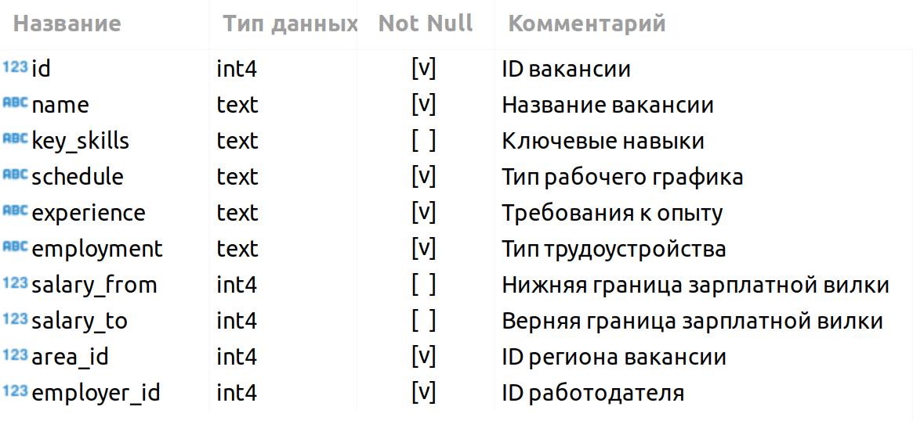

# 
 ***Project_2 - Анализ вакансий HeadHunter (hh.ru)***
---

## 
 <a id ="table_of_content">Оглавление</a>  
[1. Описание проекта](#description)  
[2. Введение. Знакомство с данными](#introduction)  
[3. Предварительный анализ данных](#unit_3)  
[4. Детальный анализ вакансий](#unit_4)  
[5. Анализ работодателей](#unit_5)  
[6. Предметный анализ](#unit_6)  
[7. Выводы](#conclusion)  
[8. Итог](#final)

---

### 
 <a id='description'> Описание проекта</a>
Наша задача в этом проекте - исследование данных для обучения нейросети, которая будет рекомендовать вакансии клиентам агенства, претендующим на позицию Data Sctientist. Проект включает в себя несколько этапов:
* Знакомство с данными;
* Предварительный анализ данных;
* Детальный анализ вакансий;
* Анализ работодателей;
* Предметный анализ.

Подробнее о каждом этапе в можно узнать в соответствующих пунктах, тыкнув на интересующий в оглавлении, или просто промотав. Я не буду особо вдаваться здесь в подробности каждого пункта, лишь кратко их опишу.

:question: Для кого это всё? :question:
Для менторов, студентов, дата-сайентистов, аналитиков, моей мамы, коллеги по работе и собаки. В общем, для любого желающего.

:question: Зачем это всё? :question:
Для практики написания качественного кода, запросов SQL и развития навыков аналитики.

:exclamation: Пару слов о процессе выполения :exclamation:
В процессе выполения работы старался комментировать интересные места и особенности, а также проводить дополнительные исследования при необходимости, отходя от заданий, где считал это необходимым. Всё для более качественного выполнения общего задания каждой части работы. Поэтому в некоторых заданиях не выводил на экран прям тот ответ, который нужно, а предпочитал выводить табличку, в которой он есть, выделял его отдельно, но также выводил данные, чтобы использовать их будущем для каких-то выводов или дополнительных исследований.

Версии и информацию об использованных в работе пакетах можно найти в файле "pyproject.toml". Соответсвенно, в качестве менеджера версий использовался poetry.

Также в репозитории в папке "graphs" можно найти получившиеся графики библиотеки plotly в формате html. Это plotly, и хотя это сильный инструмент для составления графиков, стандартно на GitHub он может не воспроизвестись спустя какое-то время. Напишите мне, и я скину вам новую версию с nbviever. Пока что ссылка следующая:

В папке images содержатся использованные картинки.

---

### 
 <a id='introduction'> Введение. Знакомство с данными</a>
Данные для исследования брались из нескольких таблиц учебной базы PostgreeSQL. Немного подробнее о них ниже. На картинках указаны имена столбцов; тип данных каждого; имеется столбец, указывающий, есть ли нулевые значения или пропуски в данных; комментарий, поясняющий содержание столбца.

* Таблица Vacancies. Хранит в себе данные по вакансиям, а также специальные столбцы для связи с другими таблицами. Содержание:

Как мы видим, в этой табличке есть столбцы, в которых есть пропуски.

* Таблица Areas. Содержит в себе код региона в справочнике и его название.

* Таблица Employers. Содержит в себе список работодателей.

* Таблица Industries. Это таблица-справочник вариантов сфер деятельности работодателей. Содержание:

* Дополнительная таблица Employers and Industries, которая существует для организации связи между работодателями и сферами их деятельности. Нужна нам, так как у одного работодателя может быть несколько направлений деятельности.

:arrow_up: [к оглавлению](#table_of_content) :arrow_up:

---

### 
 <a id='unit_3'> Предварительный анализ данных (Unit 3)</a>

Тут ничего необычного. Просто открываем таблички, смотрим их содержимое и считаем количество строк в каждой таблице, иными словами смотрим размерность данных.
Но всё же уже на этом этапе можно сделать некоторые выводы о данных.

:arrow_up: [к оглавлению](#table_of_content) :arrow_up:

---

### 
 <a id='unit_4'> Детальный анализ вакансий (Unit 4)</a>

На этом этапе я смотрю на сами вакансии: смотрю, сколько вакансий имеют/не имеют пропусков, вещи по типу стоит/стоит в вакансии уровень заработной платы и если она стоит, вычисляю среднюю среди всех, не учитывая отстутствующие данные.

:arrow_up: [к оглавлению](#table_of_content) :arrow_up:

---

### 
 <a id='unit_5'> Анализ работодателей (Unit 5)</a>

На этом этапе, как следует из названия, происходит анализ работодателей, например, кто из работодателей доминирует по количеству вакансий, кто и в каких регионах публикует вакансии, ищем среди них дубликаты с незаполненными значениями и так далее.

:arrow_up: [к оглавлению](#table_of_content) :arrow_up:

---

### 
 <a id='unit_6'> Предметный анализ (Unit 6)</a>

Последний этап, и самый, пожалуй, важный. Здесь мы исследуем непосредственно вакансии на дата-саентистов и работников с данными: требования работодателей как к опытным работникам, так и к Junior-специалистам, и к возможностям, которые они могут предложить взамен. Ну и сравниваем полученную информацию, конечно же.

:arrow_up: [к оглавлению](#table_of_content) :arrow_up:

---

### 
 <a id='conclusion'> Выводы </a>

В конце работы, конечно же, делаеются определенные выводы.

Но это ещё не всё. Объём данных не самый большой, но и не малый, и по заданию далеко не всё получилось исследовать. Поэтому также были проведены дополнительные исследования для того, чтобы итоговые выводы были более полными и объективными.

:arrow_up: [к оглавлению](#table_of_content) :arrow_up:

---

### 
 <a id='final'> Итог </a>

По итогу можно сказать, что была проделана определённая работа, и что-то из неё можно использовать в реальной задаче. Думаю, вернее, я уверен, что из этих данных можно ещё кучу информации вычерпнуть, и позже я этим, скорее всего, займусь. Так что можете поставить лайк, подписаться и следить за обновлениями. Спасибо за прочтение! :high_brightness::high_brightness::high_brightness:

:arrow_up: [к оглавлению](#table_of_content) :arrow_up:

---